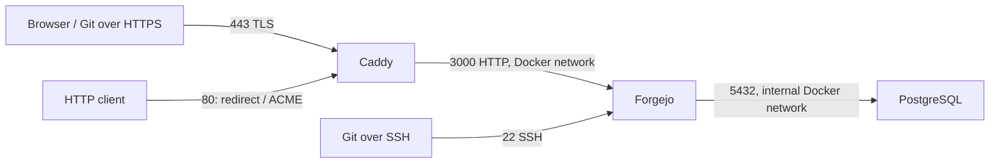

# Forgejo with automatic HTTPS and Git SSH on port 22

A small Docker Compose deployment for a self-hosted [Forgejo](https://forgejo.org/)
Git server. Caddy automatically obtains and renews **Let's Encrypt** certificates;
Git over SSH uses **port 22**, with familiar clone URLs:

```sh
git clone git@git.example.com:owner/repository.git
```

This is an independent deployment template, not an official Forgejo project.

- Forgejo with PostgreSQL and persistent named volumes.
- HTTP redirects to HTTPS; the application and database ports stay inside Docker.
- Public registration and the web installer are disabled by default.
- Explicit image versions and bounded container logs.
- No external proxy service, database service, or paid certificate required.



## Before you begin

You need a Linux server with a rootful Docker Engine, Docker Compose **v2.20+**,
a public domain pointing to the server, and inbound TCP ports **22, 80, and 443**.
UDP 443 is optional for HTTP/3. This configuration uses public ACME HTTP/TLS
challenges; a private-only server needs a different certificate challenge setup.

**Reserve host port 22 before starting.** If it is already used for server
administration, first move administrative SSH to another port and verify a new
login, or bind the two services to separate IPs. Keep your existing session open
and have recovery access. Follow the [host and DNS preparation guide](docs/operations.md#prepare-the-server-and-dns).

## Quick start

Clone or download this repository, then run the following from its directory.

### 1. Configure your domain and credentials

```sh
cp .env.example .env
chmod 600 .env
openssl rand -hex 32
```

Edit `.env` and set:

| Setting | Value |
| --- | --- |
| `FORGEJO_DOMAIN` | Your hostname, such as `git.example.com`, without a scheme, port, or path |
| `ACME_EMAIL` | Your email for the Let's Encrypt account |
| `POSTGRES_PASSWORD` | The generated random hex password |

Keep `DISABLE_REGISTRATION=true` until the administrator account exists.
Never commit `.env`, backups, credentials, or persistent application data.

### 2. Validate and start Forgejo

```sh
docker compose config --quiet
docker compose pull
docker compose run --rm --no-deps caddy caddy validate --config /etc/caddy/Caddyfile --adapter caddyfile
docker compose up -d --wait --wait-timeout 180 db forgejo
```

Create the first administrator once, replacing the example email with yours:

```sh
docker compose exec --user git forgejo forgejo --config /data/gitea/conf/app.ini admin user create --username forgejo-admin --email you@example.com --admin --random-password --random-password-length 24 --must-change-password=true
```

Save the printed password in your password manager. You can choose another
username, but the literal name `admin` is reserved by Forgejo. The public web
installer is disabled, so administrator creation uses the CLI.

### 3. Start HTTPS and sign in

```sh
docker compose up -d --wait --wait-timeout 180
docker compose logs --tail=100 caddy
```

Open `https://YOUR_DOMAIN`, sign in, and change the initial password. Caddy
requests its certificate in the background; container startup can finish before
HTTPS is ready. Check the logs if the certificate has not appeared.

Add your public SSH key in Forgejo's account settings. Then follow the
[HTTPS and SSH verification steps](docs/operations.md#verify-https-and-git-ssh),
including checking the SSH host key fingerprint, before cloning a repository.

## Configuration and operation

| Component | Pinned image |
| --- | --- |
| Forgejo | `codeberg.org/forgejo/forgejo:15.0.7` (LTS) |
| PostgreSQL | `postgres:17.11-alpine` |
| Caddy | `caddy:2.11.4-alpine` |

Forgejo provides repositories, permissions, issues, pull requests, and releases.
PostgreSQL stores application metadata; Forgejo's `/data` volume stores Git
repositories, uploads, LFS objects, configuration, and SSH host keys. **A complete
backup needs both.** SSH authorizes Git operations and does not give users a host
shell. Its keys are separate from the HTTPS certificate.

Image upgrades are manual; certificate renewal is automatic. SMTP, Actions
runners, and a scheduled off-server backup system are not included.

See the [operations guide](docs/operations.md) for:

- DNS, firewall, and SSH port preparation.
- Verification, certificate troubleshooting, and account settings.
- Persistent storage, backups, upgrades, and configuration reloads.

The configuration is based on the official [Forgejo Docker installation guide](https://forgejo.org/docs/latest/admin/installation/docker/),
[reverse proxy guide](https://forgejo.org/docs/latest/admin/setup/reverse-proxy/),
and [Caddy automatic HTTPS documentation](https://caddyserver.com/docs/automatic-https).

## Contributing and validation

Contributions are welcome. Read [CONTRIBUTING.md](CONTRIBUTING.md) for checks and
pull request guidance, and [SECURITY.md](SECURITY.md) for private security reporting.

```sh
python3 scripts/validate.py
```

The container smoke test was verified on Ubuntu 24.04 (amd64) with Docker 29.8.0
and Compose 5.5.1. Public Let's Encrypt HTTPS and authenticated SSH Git push/clone
on port 22 were also verified on a deployed instance. Static validation does not
verify those network operations; run the documented checks for your own server's
DNS and firewall configuration.

## License

The deployment files in this repository are available under the [MIT License](LICENSE).
Forgejo, PostgreSQL, Caddy, and their container images retain their respective
licenses.
