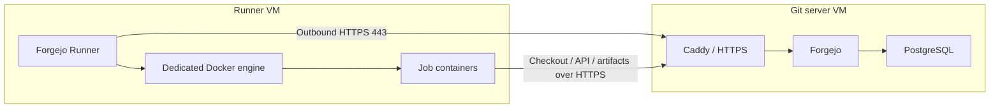

# Run Actions on a separate VM

Use a second Linux VM for CI builds while keeping Forgejo, PostgreSQL, and Caddy
on the Git server. This separates build resource usage and the privileged
Docker-in-Docker engine from the machine holding your repositories and database.
The existing [runner Compose file](../runner/compose.yaml) is standalone; no
changes to the Forgejo server's Compose file are needed.



## 1. Prepare the runner VM

Provide a Linux VM with rootful Docker Engine, Compose v2.20+, Git, and curl.
Ubuntu 24.04 on amd64 matches the runner's existing tested platform. For the
default limits, **4 vCPUs, 8 GiB RAM, and 80 GiB disk** are a starting example,
not a minimum for every workload. DinD is capped at 3 CPUs and 5 GiB RAM; the
runner is capped at 0.5 CPU and 512 MiB, with one job at a time. Size disk for
your images, build caches, and workspaces, and monitor free space.

The VM needs outbound network access and can sit behind NAT. It does not need
its own public domain, Let's Encrypt certificate, or inbound runner port.

| Connection | Access required |
| --- | --- |
| Runner and job containers → Forgejo | TCP 443 to the existing Forgejo HTTPS hostname; allow return traffic. |
| Runner VM and containers → DNS, registries, actions, package sources | DNS through your resolver and outbound HTTPS to the services your workflows use, including `data.forgejo.org` and `ghcr.io`. |
| Jobs → deployment targets | Only the ports and destinations your deployments require. Add Git SSH access on TCP 22 if a workflow uses SSH checkout. |
| Administrator → runner VM | Your chosen administrative SSH port, restricted to your trusted IPs or VPN. |

Administrative SSH can stay on **22 on the runner VM**. Forgejo's Git SSH port
22 and Caddy's ports 80/443 remain on the Git server. There is no reason to
expose Docker ports 2375/2376 or cache ports 8088/8089 between the VMs. Keep the
runner's network access to other private services limited to what jobs require.

On the **runner VM**, clone this repository and check the existing HTTPS endpoint
with your real hostname:

```sh
git clone https://github.com/omerkarabacak/forgejo-deploy.git
cd forgejo-deploy
docker compose version
curl --fail --silent --show-error https://git.example.com/api/healthz
docker compose -f runner/compose.yaml config --quiet
```

Keep these commands in the repository root. Always specify
`-f runner/compose.yaml` for this deployment. The root `compose.yaml` starts the
Git server stack. Do not copy its `.env`, database credentials, SSH host keys,
backups, or certificate volumes onto the runner VM.

## 2. Register and start the runner

Follow [Register and start](actions-runner.md#register-and-start) **on the runner
VM**. Create a fresh repository-scoped registration named, for example,
`build-vm-1`. Use the server's real HTTPS URL in `runner/state/config.yml`;
`localhost` and Docker service names such as `forgejo` will not reach another
VM. The UUID, token, and private configuration belong only in `runner/state`.

Before starting, add a distinct label to `runner.labels` in that private
configuration so you can direct a test job to the new machine:

```yaml
runner:
  labels:
    - runner-vm:docker://ghcr.io/catthehacker/ubuntu:act-24.04
```

This snippet only shows the label setting; keep the other runner settings in
the copied example. During migration, initially **replace** the default
`ubuntu-latest` and `ubuntu-24.04` labels with `runner-vm`, so ordinary workflows
continue to use the original runner until the new machine is verified.

Leave the cache hostname `runner-cache.internal` and its gateway mapping as
provided. They connect nested jobs to the cache within this VM. No shared disk,
Docker network, host Docker socket, or tunnel to the Git server is required.

## 3. Verify a job on the new VM

Confirm the new runner is online in the repository's Actions settings. Put this
manual workflow in `.forgejo/workflows/runner-vm-check.yml` in that repository,
commit it to the default branch, then run it from the Actions page:

```yaml
name: Check runner VM
on:
  workflow_dispatch:
jobs:
  check:
    runs-on: runner-vm
    steps:
      - name: Reach Forgejo from a job container
        run: curl --fail --silent --show-error "$FORGEJO_SERVER_URL/api/healthz"
      - name: Check Docker access
        run: |
          docker version
          docker compose version
          docker run --rm hello-world
```

Forgejo supplies `FORGEJO_SERVER_URL` to workflow steps. This checks
HTTPS from inside the job and use of the dedicated Docker engine. Also test a
private checkout and your application's build before enabling deployment jobs;
test cache save and restore on two runs if the workflow uses caching. A healthy
container alone does not prove the runner is registered or jobs can reach
Forgejo. See [runner verification and maintenance](actions-runner.md#verification-and-maintenance).

## 4. Move existing jobs or add capacity

To move jobs from the Git server, first verify the new runner with the distinct
label above. Check deployment allowlists and private network routes for its new
source IP. Files or services previously available only on the Git server also
need an explicit way to be reached by the new jobs.

Pause new workflow triggers and wait for jobs on the original runner to finish
while switching. On the **original runner host**, stop its project without
removing data:

```sh
docker compose -f runner/compose.yaml stop
```

On the **new runner VM**, add `ubuntu-latest` and `ubuntu-24.04` back to its label
list if existing workflows use them, then restart the runner to reload it:

```sh
docker compose -f runner/compose.yaml restart runner
```

Resume workflows and verify a normal build and deployment. After accepting the
migration, delete the old runner's registration in Forgejo. Until then, keeping
its registration and storage lets you stop the new runner and restart the old
one if needed. Docker images and local caches start fresh on the new VM;
repository Actions secrets stay in Forgejo and need no manual transfer.

To keep both runners or add more VMs, register each one separately with its own
UUID, token, and local state. Matching labels let Forgejo assign eligible queued
jobs across them; unique labels select a particular pool. Each VM runs one job
at a time with the supplied configuration. Never run two VMs with the same
copied runner identity.

This remains a persistent runner for trusted workflows. A separate VM does not
isolate jobs from earlier jobs on that VM or from reachable network services.
Review the [Forgejo Actions security guide](https://forgejo.org/docs/latest/admin/actions/security/)
for untrusted contributions or ephemeral runners. VM creation, autoscaling, and
runner backup scheduling are left to the operator.

References: [runner registration](https://forgejo.org/docs/latest/admin/actions/registration/)
and [workflow labels and variables](https://forgejo.org/docs/latest/user/actions/reference/).
